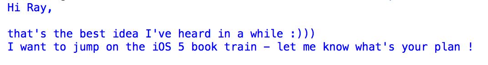
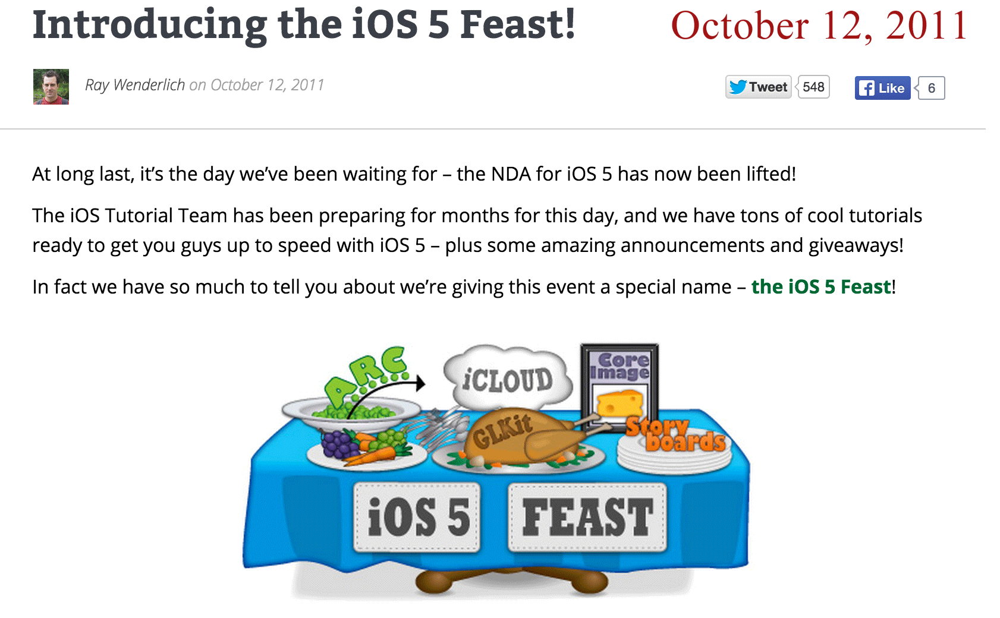

# [fit] raywenderlich.com folklore

---

^ I often speak at iOS conferences in Europe and people *always* ask me: “What's it like to write at raywenderlich.com”, “How many people are on the team?”, and “Does Ray actually exist?”.

---

^ So I thought it would be cool for my session at RWDevCon to answer all of these questions, give you some behind the scenes stories and folklore from the raywenderlich.com team.

---

^ If you attended Ray’s keynote, you know how the site started as Ray's personal blog, and grew to 100+ authors and editors from around the world. In my talk, I’ll revisit the raywenderlich.com timeline, but try to highlight some interesting and fun moments along the way.

---

^ Let’s go back to the very beginning of time. Let’s go back to...

 

---

# January 24th, 2010.
 
---

^ This is the very first on raywenderlich.com - It’s called Drinking from a fire hose and it’s still online if you want to check it out. In this post Ray just rants randomly about how web technology changed since the 90s and that he has to learn many new stuff. It also features this weird image of bursting water.

^ After posting this, Ray most probably coded the whole night and on the next day January the 25th he was like “Doh, this is not what your first blog post should be!”

---

^ So he brought up another weird post called “What’s this blog about?” in which he reminisces about what a fan of C++ and Python he is and he used an image with PHP code. He also shyly shares that he’s working on iPhone apps.

---

^ It was 2010 and at the time nobody would have guessed that raywenderlich.com would become the most popular iOS development blog. 

^ After all, there wasn’t a team behind the web site - it was just Ray writing from his mother-in-law’s basement (kind of) to save money as he was starting out as an indie iOS developer.

---

^ And he wasn’t the best designer either. I’m sure his web site’s design and particularly 

---

^ how he snipped off the top of his own logo brought developers with mild OCD on the floor in seizures around the world.

---

^ And he wasn’t the "business success" type you would imagine to have a pimped up successful blog. In fact he was pretty goofy.

---

## One App Store Just Isn’t Enough
## Java Is Da Bomb
## Visual Interface Design is for Pansies

^ For example when he first announced that he’s ditching iOS development and switching to Android many people didn’t exactly know what to think.

---

# [fit] April Fools 2011, everyone!

^ Of course this turned out to be an April fools’ hoax but it really told a lot about who Ray was.

---

^ Seemingly against all odds - it turned out that content is king, and people really liked the tutorials on the site. Because Ray kept posting tutorials about exactly what developers wanted to learn!

---

^ So in 2011 he had a call for authors on the web site. It was a very difficult decision for Ray to make. When he was telling me about this moment I can see his eye twitch just a little bit.

^  Fun fact: from this original team 30% are still here today 4 years later (which in iOS time is like ... from dinosaurs till right now).

---

^ In 2011 the first team launched the first RW products - the newsletter...

---

^ ... and the first paid product: the space game starter kit. Look at this store page - funny how empty it looks, right?

---

^ I want to take a moment and talk about another of the founding members who many of you may know: Matthijs Hollemans.

^ Matthijs has one of the typical early team members stories. He quit his job in 2010 to try make it on his own as a freelance iOS developer. 

---

^ In 2011 he joined the tutorial team and shortly after he wrote the “missing book” on beginning iOS development: the iOS Apprentice.

---

^ I bet many of you recognize the Bull’s Eye app from the iOS Apprentice. Matthijs wrote the book back in 2011, but he updates it every year to the new iOS version: from iOS 5 -> 6 ... 

---

^ ... -> 7 -> 8, and he even updated the book to an entirely new programming language: Swift.

---

> ... every time I told myself, “This is the last time.” I mean, this is a 1,000 page book... But Apple has this way of screwing up my plans.
-- Matthijs Hollemans

^ Every years he says no more, but Apple introduces new and cool to cover in the new edition. But that’s cool because people love the free updates and Matthijs now actually makes a comfortable living off the iOS Apprentice and his other iOS books.

---

^ Our first book together as a team is a kind of funny story. Let me rewind a little bit.

---

^ In June 2010 I wrote to Ray saying “just an idea - have you thought of putting together all your great tutorials ... as a paid download PDF ... it can have some exclusive extra nice stuff too” because I thought that was a great idea.

^ And he was like “that’s a great idea and definitely something I’ll have to consider...”

---

^ 15 months later I receive this message, where in a Jobs-like way he pitches the idea back to me: “We’ve been discussing ... the idea of joining together to write an eBook on the new technologies in iOS5. So far there are three of us interested (me, Felipe and Steve).”

---

^ And the funny thing is I completely bought it:

^ “Hi Ray, that’s the best idea I’ve heard in a while :)))”

---

^ I have to give Ray credit - he was the one to bring us all together for the book and planned and executed our first book launch and that started it all for us as iOS book authors.

---

^ Since for that book we all worked separately by ourselves scattered around the world when we were done the book ended up being so big it couldn't fit in a single print book, so we had to make it 2 volumes. What were we thinking?! :]

---

^ Remember how I mentioned one of the three authors interested in working on iOS 5 by Tutorials was Felipe? Well, he’s also one of the early members of the team and he also is SO much fun.

^ Here’s how he took over the team in one "Swift" motion. 

---

^ This is what August 2011 looked like for Felipe:

^12th - Marin recommends him for the job Felipe works at to this day, at Lextech, one of the sponsors of this conference

^23rd - Ray officially introduces Felipe to the team

^25th - Felipe is an author on the iOS 5 by Tutorials book.

---

^ And all this he achieved only in the month of August!

^And this is not a coincidence... 

---

^ Felipe IS adorable, and brings a lot of humor, passion, and Apple fanboy-ism to the team.

---

^  Final Felipe fun fact - there’s a game on the App Store called Flappy Felipe which features Felipe with a sombrero.

---

^ Felipe made one very important contribution to the raywenderlich team. He was the first to go “out of line” and bring personal matters in the team. He needed some guidance about the life, the universe and everything else. So he sent around an email with questions and asked for guidance, so all of us shared past expiriences and opinions in an effort to help him out. Which was also when we stopped being just some guys around the world and became a team.

---

^ And while the website and the team was rapidly changing and growing Ray somehow managed to remain goofy and oblivious of all design trends. Not to mention to the hilariously nerdy Christmas songs he started posting on the web site.

---

^ Here’s the April fool’s joke post from 2012. Ray told people there was actually an undocumented thermometer sensor in the iPhone and he released for sale a Thermometer App Starter Kit.

^ Using this starter kit people would quickly build all kind of apps from a sickness detector app (you just stick your iPhone under your tongue and measure your temperature) to a turkey baker app(you put your phone into the turkey and it lets you know when it’s baked).

^ Quite some people tried to buy this one!

---

^ In 2012 we wrote iOS 6 by Tutorials. And this time we did it professionally - editors and all. And this is important because ...

---

^ The editors at raywenderlich.com are known to be sticklers for detail and apt to write pages of feedback ... so when I had my first massive set of editor feedback, I almost cried. Tip: the black text is non-edited text.

---

^ And then you receive the longest email with destroying feedback!

---

^ So you *buckle up* and up your game.

---

^ But let’s not get too emotional here. By the end of 2012, the web site was going great and Ray decided to take yet another big step forward and hire an employee #1 - who turned out to be Brian Moakley, who's here with us today. So what made Brian the one?

---

^ Although Brian looks adorable, he’s one tough cookie. Besides being a brilliant iOS and web developer he also has a minor in creative writing. 

---

^ A high point for Ray, who's a huge Walking Dead fan - Brian also has a blog about zombies with over 1,000 posts.

^  He had to survive all the interviews Ray and Vicki plotted out for him. 

---

^ The last one was at a hotel here in DC and it lasted 5 hours, consisting of a massive test involving iOS programming, editing, algorithm development, and more - which Brian had to code on his ancient Macbook laptop that had keys missing from the keyboard and a tendency to seg-fault.

---

^ One of the first projects Brian worked was integrating the new raywenderlich.com design.

---

^ And I’m happy to report that this time someone other than Ray was in charge of cutting the logo image.

---

^ Also, 2013 was the year we really came together as a team. 

^ I think this was mostly because we decided to write 2 books that summer: one about iOS 7, and one about creating games with Sprite Kit. There were more authors and editors involved in this process than ever before. It really pushed us to the edge. And some of us - over it.

^ But what does not kill you makes you stronger!

---

^ And this is how we reached iOS 7 launch day. We all waited in the team chat for iOS 7 to come live so we could put the shiny new books for sale on the website.

^ Marin “guys I really need to go to the toilet, but I’m afraid that I’ll miss the big moment ... can you hold the release another 10 minutes please”

^ Ray “haha”

^ Felipe “marin take us with you ... you’ve got WiFi”

^ Greg “NO, do not take us with you!”

^ Mic “Marin isn’t really to the loo; he’s actually the chap at Apple responsible for flipping the switch”

^ Greg “In that case, hurry to the ‘toilet’ and ‘flush’ iOS 7 already”

^ As you can see when there’s a critical mass of editors in the same place every chat line becomes a pun!

^ And of course as soon as I was off my laptop...

^ “Woot” “It’s coming” “iOS 7” “I see it”

^ Finally Greg remembers about me “Marin come back!”

^ Thanks guys. Isn’t it so much more fun to launch a product with friends?

---

^ And this is how we get to Christmas Time 2013... 

---

^ A message comes around to a secret team from Marin called “Xmas surprise for Ray - read inside and keep quiet about it!” It’s November the 18th.

^ “NB! Do not tell Ray under any circumstances” in caps and surrounded by umbrellas! Top secret stuff!

^ “I thought it would be fun if a number of us sent an Xmas care package to Ray and Vicki.” details follow ...

---

^ Next day November the 19th, I have confirmation from 10 people they want to take part and the conspiracy is set in motion.

---

^ On December 2nd I send around another email to remind everyone about our arrangement since it’s about time to send the packages.

^ Marin “I sent mine today and the not-so-nice lady at the post said it’s gonna be there in about 10 days”

^ And while everyone is planning to send our packages a message from Mattjis comes (it’s December the 6th now)

---

^ “OK, Ray got my package ... it’s for the Sinterklaas holiday, which we celebrated on the 5th of December, not the 25th - so it got there right on time” 

---

^ And as each package arrived Ray sent back via email a Thank xmas card. And as you will notice he has just purchased a green screen...

---

---

---

---

---

^ It was a great Christmas!

---

^ This bring us up to the present day. Do you remember how it all started?

---

^ The team keeps growing - we have all kinds of bright people joining from all over the world. In fact, if you're an advanced iOS developer interested in joining the team as an author or editor, just contact Ray to see if you'd be a good fit - this is really a community effort, and we're open to folks from all backgrounds.

---

^ For example, Darryl Bayliss is one of our most recent team members and is our resident Android correspondent. And he had one thing to tell us iOS devs ...

---

> To those who still think iOS is the superior Operating System, I hope you enjoy AutoLayout. We’ve dealt with that pain for years :)
-- Darryl Bayliss

^ I hope you enjoy AutoLayout. We’ve dealt with that pain for years

---

# About Ray...

^ So at last, let’s bring this ride around and look into “Does Ray exist?” and "What is he like?”.

---

^ It was last autumn when Ray and I met for the first time after 4 years of working together to record the “iOS Animations by Tutorials” video series

---

^ We came up with the idea of meeting in the middle of where we live - the US and Berlin - and renting a beach house in Portugal so we could combine recording videos and hitting the beach.

---

# And so we met

^ For me it was an emotional event. I was one of the first people on the team and yet I hadn't ever met Ray in person. 

^ He existed, and was still a really down to earth guy, he was tons of fun too - we played board games, drank wine and travelled around.

---

^ One day we were coming back from lunch and I felt like simply saying thanks because to be honest without the editors, the team and leverage of raywenderlich.com I would never have published a great book in the US like iOS Animations by Tutorials.

^ And he said “That’s one of my goals for raywenderlich.com - to empower developers like you and help them grow and make a living doing this.”

^ And he said that simply and honestly as it was nothing really.

---

^ You could never tell he built up and runs a 100+ team spread around the world.

---

^ And so after Portugal we started preparing for RWDevCon. 

---

^ But I don’t need to tell you about RWDevCon, do I? 
^ You’ve experienced it yourselves... what do you think?

^ Our hope is that it turned out to be awesome and memorable experience, and that it adds lots of stories to the raywenderlich.com folklore in the years to come. 

---

^ The whole point of this talk was not simply to point to our accomplishments, or make fun of Ray's design skills. Instead, it was to show you that we're just normal developers that teamed up and love it!

^ The raywenderlich.com team is just one of the many ways you can be part of the iOS community. GitHub, podcasts, StackOverflow, or raywenderlich.com itself - cultivating a group of friends like we have here, will encourage you and push you to new levels - and you will have fun at the same time. 

^This way, some day you can look back on your stories and memories, and folklore with fondness, just like we did here today.

---

# [fit] Thank you!